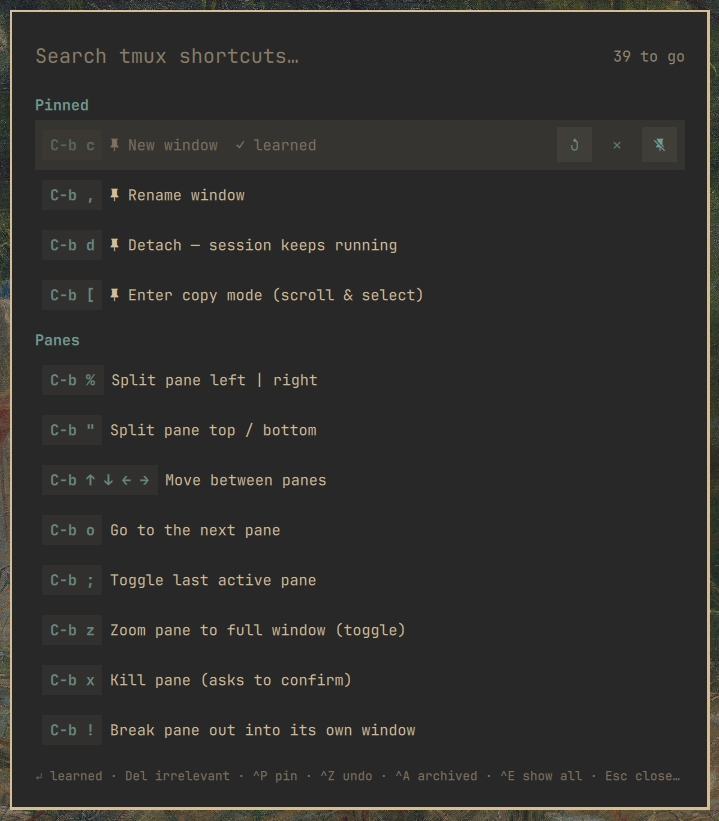

# Tmux Helper for Omarchy

A curated tmux cheat-sheet that shrinks as you learn.



Instead of dumping all 200+ tmux bindings on you, Tmux Helper shows the ~40
default bindings that actually matter — hand-picked, grouped, and described
in plain language. As you get better, you curate: mark shortcuts **learned**
or **irrelevant** and they get out of your way. What's left is your personal
"still learning" list.

## Install

Requires Omarchy 4.x (Quattro). No hard dependencies beyond the Omarchy
shell itself: `tmux` is optional — with it, the sheet shows your real prefix
and the Ctrl+E "More" sections parse your live config; without it, the
curated list still works with stock defaults.

```bash
omarchy plugin add https://github.com/alexdont/tmux-helper.git --enable
```

Optional keybinding (add to `~/.config/hypr/bindings.lua`):

```lua
o.bind("SUPER + SHIFT + T", "Tmux cheat sheet", "omarchy-shell shell toggle io.github.alexdont.tmux-helper '{}'")
```

## Use

Open it from the bar icon or your keybinding. Type to search.

- **Enter** — mark selected shortcut **learned** (hides it, counts as progress)
- **Delete** — mark it **irrelevant** (hides it, shrinks the total)
- **Ctrl+P** — pin to the top. Pinned entries never hide — a learned pin
  stays visible wearing its ✓, so the Pinned section is your reference card
- **Ctrl+Z** — undo · **Ctrl+A** — show archived (learned/irrelevant) to
  review or un-mark · **Esc** — clear search, then close
- **Ctrl+E** — reveal the "More" sections: every other binding from your
  *live* tmux config (prefix, no-prefix, and vi copy-mode tables), deduped
  against the curated list. Fully curatable too.

The sheet shows your **real prefix** (read live from tmux — `C-a` users see
`C-a`), while teaching default keys that transfer to any machine. Copy-mode
selection keys are labeled "(vi keys)".

State lives in `~/.local/state/omarchy/io.github.alexdont.tmux-helper/state.json` —
plain JSON, dotfiles-friendly.

## License

MIT

## Remove

```bash
omarchy plugin remove io.github.alexdont.tmux-helper
```

Curation state is left behind at `~/.local/state/omarchy/io.github.alexdont.tmux-helper/`;
delete that folder too if you want a clean slate. The plugin never modifies
any other configuration — the optional keybinding above is added by you.
